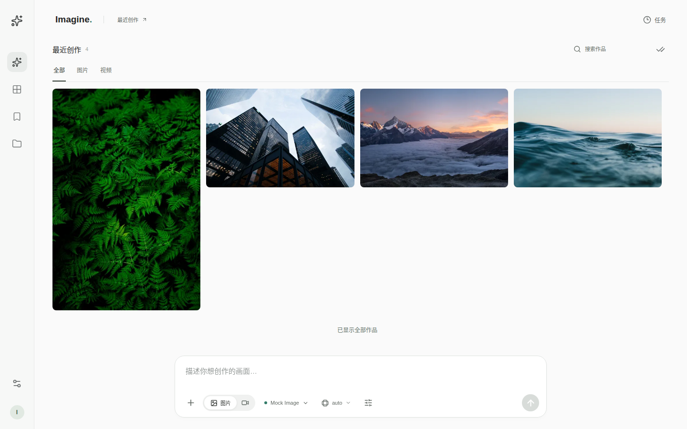
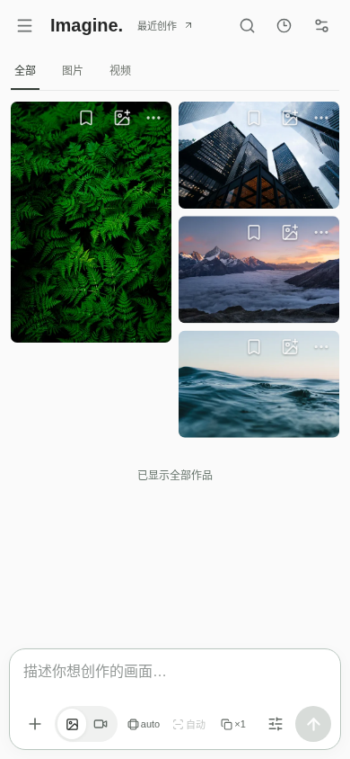

<div align="center">


# Imagine Media Studio

**一个轻量、自托管的 AI 图片与视频创作工作台**

接入自己的生成 API，在同一个工作区完成创作、编辑、预览与作品管理。<br>
独立桌面与移动布局，一个容器即可部署。

**简体中文** | [English](./README_EN.md)

[](https://github.com/YuSaZh/imagine-media-studio/actions/workflows/ci.yml)
[](https://github.com/YuSaZh/imagine-media-studio/releases/latest)
[](./LICENSE)
[](https://github.com/YuSaZh/imagine-media-studio/pkgs/container/imagine-media-studio)

[界面预览](#screenshots) · [核心功能](#features) · [快速部署](#quick-start) · [接入模型](#providers) · [常见问题](#faq)

</div>

> 本项目提供生成任务的 Web 界面，不包含模型推理服务或 API 额度。真实生成需要自行配置可用的外部 API；提示词和参考素材会发送给你选择的服务商。作品与任务保存在你部署的服务器上，API 密钥由服务端加密保存。

<a id="screenshots"></a>
## 界面预览

<details>
<summary><strong>展开桌面端与移动端截图</strong></summary>

### 桌面端



### 移动端



截图来自本项目工作区的自动化验收，图中媒体为测试上传素材。README 展示 `main` 的当前实现；稳定版的功能范围以对应版本的 [更新记录](./CHANGELOG.md) 为准。

</details>

<a id="features"></a>
## 核心功能

### 图片生成与编辑

- 文字生图、参考图编辑与蒙版局部编辑，支持上传、粘贴和拖入图片。
- 内置蒙版画布，提供画笔、橡皮擦、撤销与重做。
- 按模型能力选择画幅、分辨率、数量、质量等参数；兼容模型可使用自定义像素尺寸。
- 作品可直接加入参考图，继续下一轮创作；支持原图查看与下载。

### 视频创作

- 支持文生视频、首帧视频和多参考图视频，具体模式由接入模型决定。
- 桌面端提供独立的视频模式、分辨率和时长快捷控件，支持模型允许范围内的自定义值。
- 跟踪异步任务进度，提供取消、重试、视频封面、在线播放和原文件下载。
- 批量生成拆分为独立任务，单个任务失败可单独处理。

### 连接与模型管理

- 接入 OpenAI / OpenAI 兼容、Google Gemini、xAI，以及自定义 HTTP / 可信 JavaScript 适配器。
- 一个连接可管理多个模型，每个模型可指定调用协议、参数选项、默认值和固定参数。
- 支持远端模型目录搜索与手动添加模型，区分不同连接下的同名模型。
- 支持通过 Chat Completions 生图的兼容接口；图片请求遇到明确的协议不兼容错误时，可自动尝试其他兼容协议。

### 工作区与作品管理

- 图片与视频统一进入虚拟瀑布流，支持搜索、类型筛选、收藏和批量操作。
- 使用项目组织作品，在项目中生成的新作品自动归入当前项目。
- 按账号、项目、图片/视频模式和模型记住生成配置。
- 桌面端与移动端分别维护布局：桌面端固定顶部工具区、独立滚动画廊；移动端保留紧凑输入区与触屏交互。

### 账号、数据与 PWA

- 管理员可创建、停用账号；各账号的作品、任务、项目和偏好相互隔离，连接与模型目录由管理员统一管理。
- API 密钥在服务端加密保存，配置导出不包含密钥和自定义请求头。
- 支持数据库备份、完整数据归档、完整性检查和缺失缩略图/视频封面的修复。
- 提供 PWA 安装入口、更新提示，以及已登录会话下的离线预览和草稿恢复。离线时不提交生成任务。

<a id="quick-start"></a>
## 快速部署

### Docker Compose 部署

需要 Docker 和 Docker Compose v2。镜像支持 `linux/amd64` 与 `linux/arm64`；无需部署本地模型或安装 GPU 驱动。

**1. 在新的部署目录中准备数据和初始配置**

以下命令适用于 Bash 环境，并需要 `openssl`。只在首次部署时生成 `.env`：

```bash
mkdir imagine-media-studio
cd imagine-media-studio
umask 077
mkdir -p data
chmod 700 data
(
  set -o noclobber
  printf 'APP_SECRET=%s\nADMIN_USERNAME=admin\nADMIN_PASSWORD=%s\nPUID=%s\nPGID=%s\n' \
    "$(openssl rand -hex 32)" "$(openssl rand -hex 16)" "$(id -u)" "$(id -g)" > .env
)
```

`.env` 中的 `ADMIN_PASSWORD` 是随机生成的初始管理员密码。请妥善保存 `.env`；其中的 `APP_SECRET` 用于解密已保存的 API 密钥，后续升级和恢复时必须保留原值，不要重新生成。

**2. 创建 `compose.yaml`**

```yaml
services:
  imagine-media:
    image: ghcr.io/yusazh/imagine-media-studio:latest
    restart: unless-stopped
    user: "${PUID:-1000}:${PGID:-1000}"
    ports:
      - "${IMAGINE_MEDIA_HOST_PORT:-3030}:${APP_PORT:-3030}"
    volumes:
      - ./data:/data
    environment:
      APP_PORT: "${APP_PORT:-3030}"
      DATA_DIR: /data
      APP_SECRET: "${APP_SECRET:?APP_SECRET is required}"
      ADMIN_USERNAME: "${ADMIN_USERNAME:-admin}"
      ADMIN_PASSWORD: "${ADMIN_PASSWORD:?ADMIN_PASSWORD is required}"
      MOCK_PROVIDER_ENABLED: "false"
      PUBLIC_BASE_URL: "${PUBLIC_BASE_URL:-}"
      TRUST_PROXY_HOPS: "${TRUST_PROXY_HOPS:-0}"
      ALLOW_INSECURE_PROVIDER_HTTP: "${ALLOW_INSECURE_PROVIDER_HTTP:-false}"
      ALLOW_PRIVATE_NETWORK_ACCESS: "${ALLOW_PRIVATE_NETWORK_ACCESS:-false}"
      ALLOW_HTTP_MEDIA_DOWNLOADS: "${ALLOW_HTTP_MEDIA_DOWNLOADS:-false}"
```

**3. 启动并登录**

```bash
docker compose up -d
```

访问 `http://localhost:3030`，或将 `localhost` 换成服务器地址。用户名为 `admin`，密码见 `.env` 中的 `ADMIN_PASSWORD`。若宿主机端口已占用，在 `.env` 中设置其他 `IMAGINE_MEDIA_HOST_PORT`。

登录后打开 **设置 > 连接** 添加 API，再添加或选择模型，即可开始创作。初始化后请在 **设置 > 账号管理** 修改账号信息；修改环境变量不会重置已有账号。

### 镜像版本与更新

| 镜像标签 | 用途 |
| --- | --- |
| `latest` | 最近发布的稳定版本 |
| `0.1.2` 等版本号 | 固定某个稳定版本 |
| `test` | 最近一次通过验证并发布的测试镜像 |
| `test-sha-<完整提交 SHA>` | 按源码提交区分的测试镜像 |
| `@sha256:<摘要>` | 固定镜像内容，用于可重复部署与回滚记录 |

需要测试版时，将 `image` 改为 `ghcr.io/yusazh/imagine-media-studio:test`。`main` 的代码推送只会触发 CI；维护者还需运行 **Test Image** 工作流，验证通过后才会更新 `test`。

升级前先按 [备份与升级指南](./RELEASE.md) 备份数据，保留原 `.env` 和数据挂载，然后在部署目录执行：

```bash
docker compose pull
docker compose up -d
```

拉取镜像后需要重新创建容器才会生效，单独执行 `pull` 或 `restart` 不会让旧容器切换镜像。生产环境需要精确锁定版本时，使用发布记录中的镜像摘要。

<a id="providers"></a>
## 接入模型

### 支持的协议

| 接口类型 | 图片协议 | 视频协议 |
| --- | --- | --- |
| OpenAI / OpenAI 兼容 | Images、Responses Image Tool、Chat Completions Image | 兼容 Videos API |
| Google Gemini | Generate Content、Interactions Image | Veo Operations、Omni Interactions Video |
| xAI | Imagine Images | Imagine Videos |
| 自定义 HTTP | 声明式 JSON/YAML 请求、响应提取 | 支持声明异步提交与轮询 |
| 可信 JavaScript | 管理员安装的服务端适配器 | 取决于适配器实现 |

上表表示已实现的协议适配，不代表每个服务商或模型都支持全部功能。画幅、分辨率、时长、参考图、蒙版、取消和批量限制，以模型能力及上游接口为准。

### 第一次配置

1. 在 **设置 > 连接** 添加连接，填写接口类型、Base URL 和 API Key。
2. 检查连接，在远端目录中选择模型，或手动填写完整模型 ID。
3. 核对模型调用协议和支持的操作，按需设置参数规则。
4. 返回创作页，选择图片或视频、模型，输入描述并提交。

OpenAI 兼容连接的 Base URL 通常包含 `/v1`，例如 `https://api.example.com/v1`；请以服务商说明为准，不要把 `/chat/completions` 等完整操作路径当成 Base URL。

模型名称相同，不代表网关开放的协议相同。例如，一些 Gemini 图片模型通过聊天接口提供生成能力，可在模型配置中选择 **OpenAI · Chat Completions Image**。协议回退不会绕过模型参数限制，也不会因超时、限流或不明确的失败盲目重新生成。

### 公网参考图与自定义适配器

在 **设置 > 账号管理** 配置公网 HTTPS 域名，或通过 `PUBLIC_BASE_URL` 提供初始值，可让支持的协议使用 15 分钟有效的签名参考图链接。未配置时使用对应协议支持的内嵌图片或上传方式。兼容网关是否能抓取链接，由其网络环境决定。

自定义适配器入口位于连接的适配器管理页，示例见 [examples/custom-providers](./examples/custom-providers)。支持校验、脱敏请求预览、Dry Run、响应路径测试及版本管理。JavaScript 适配器属于管理员信任的服务端代码，不是安全沙箱。

<a id="configuration"></a>
## 配置与数据

| 配置项 | 说明 |
| --- | --- |
| `APP_SECRET` | 长期保留的加密密钥，生产部署建议至少 32 个随机字符 |
| `ADMIN_USERNAME` / `ADMIN_PASSWORD` | 仅首次启动时创建管理员；应用默认值为 `admin` / `admin`，上面的部署步骤会生成随机密码 |
| `IMAGINE_MEDIA_HOST_PORT` / `APP_PORT` | Compose 宿主机端口 / 容器内端口，默认均为 `3030` |
| `PUID` / `PGID` | Compose 容器运行用户，用于匹配数据目录权限 |
| `DATA_DIR` | 应用数据路径，容器中使用 `/data` |
| `PUBLIC_BASE_URL` | 公网应用地址，供签名参考图链接使用；可在界面中覆盖 |
| `TRUST_PROXY_HOPS` | 默认 `0`；仅在受信任的反向代理后设为 `1` |
| `MOCK_PROVIDER_ENABLED` | 测试 Provider 开关；上面的部署示例关闭它 |
| `ALLOW_INSECURE_PROVIDER_HTTP` | 允许使用 HTTP Provider，默认关闭 |
| `ALLOW_PRIVATE_NETWORK_ACCESS` | 允许访问内网 Provider 或媒体地址，默认关闭 |
| `ALLOW_HTTP_MEDIA_DOWNLOADS` | 允许下载 HTTP 返回媒体，默认关闭 |

其他上传大小、超时和日志参数见 [.env.example](./.env.example)。使用其他参数时，也要将其传入 Compose 服务的 `environment`。

- **持久化：** SQLite、媒体、项目和任务放在 `/data`，不是仅保存在浏览器里。多台设备登录同一账号可访问该账号的服务器数据。
- **备份：** 界面中的数据库备份不包含图片和视频；完整迁移使用 [离线数据归档](./docs/architecture/pr8-data-archive.md)，并单独保管 `.env` / `APP_SECRET`。
- **反向代理：** 对外使用 HTTPS。若启用 `TRUST_PROXY_HOPS=1`，限制应用端口只能被代理访问，并正确转发 `Host`、`X-Forwarded-Proto`。详细示例与边界见 [RELEASE.md](./RELEASE.md)。

<a id="development"></a>
## 本地构建与验证

需要 Node.js 24、pnpm `11.23.0`，以及可通过 `PATH` 调用的 FFmpeg。

```bash
git clone https://github.com/YuSaZh/imagine-media-studio.git
cd imagine-media-studio
corepack enable
corepack prepare pnpm@11.23.0 --activate
pnpm install --frozen-lockfile
pnpm build
```

以下启动方式使用独立临时数据和 Mock Provider，适合本地验证。请先确认 `13030` 未被占用：

```bash
IMAGINE_DEV_DATA="$(mktemp -d /tmp/imagine-media-dev.XXXXXX)"
APP_PORT=13030 DATA_DIR="$IMAGINE_DEV_DATA" \
  WEB_DIST_DIR="$PWD/apps/web/dist" \
  ADMIN_USERNAME=admin ADMIN_PASSWORD=local-preview-only \
  APP_SECRET="$(openssl rand -hex 32)" MOCK_PROVIDER_ENABLED=true \
  pnpm --filter @imagine/server start
```

访问 `http://localhost:13030`，使用 `admin` / `local-preview-only` 登录。Mock 仅产生测试输出，不调用真实模型。需要持久部署时请使用前面的 Compose 配置。

```bash
pnpm run ci
pnpm exec playwright install --with-deps chromium
E2E_PORT=13031 pnpm test:e2e --update-snapshots=none
```

`pnpm run ci` 包含 lint、类型检查、单元测试与生产构建。浏览器验收覆盖 8 种视口、功能交互、无障碍和视觉基线。E2E 同样需要未占用的端口，并会创建、清理自己的临时数据；不要针对已有部署运行破坏性测试。

技术栈：React 19、TypeScript、Vite、TanStack Query / Virtual、Radix UI、Fastify、SQLite / Drizzle、Sharp、FFmpeg、Workbox。运行边界为一个 Node.js 应用、一个 SQLite 数据库、一个端口和一个 `/data` 挂载。

<a id="faq"></a>
## 常见问题

**需要 GPU 或模型文件吗？**

不需要。推理由接入的 API 服务商完成，本项目负责界面、任务和媒体管理。API 费用及可用额度由服务商决定。

**连接测试通过，为什么仍不能生成？**

连接或模型目录可用不代表生成接口、模型额度和参数都可用。请核对模型 ID、调用协议、上游权限及任务错误详情；不要将真实 API Key 放进 Issue、截图或日志。

**可以部署到 GitHub Pages 或纯静态托管平台吗？**

当前架构需要 Node.js 服务端、SQLite 和持久化数据目录，不能只上传前端构建文件。推荐 Docker，或运行完整的 Node.js 应用。

**为什么手机上没有安装入口，或离线不能生成？**

PWA 依赖浏览器支持与 HTTPS 安全上下文，`localhost` 可用于本地测试。离线功能用于已缓存的预览和草稿，不提供离线模型推理。具体真机验证范围及其他已知限制见 [Hold.md](./Hold.md)。

**为什么拉取 `test` 后没有出现刚合并的功能？**

`test` 只跟随成功完成的测试镜像发布，不自动跟随每次提交。确认对应 Test Image 工作流已成功，然后重新拉取并创建容器；PWA 已打开的页面还可能需要接受更新或刷新。

<a id="documentation"></a>
## 文档与反馈

- [English README](./README_EN.md)
- [更新记录](./CHANGELOG.md) · [发布、升级、备份与回滚](./RELEASE.md)
- [自定义 Provider 示例](./examples/custom-providers) · [数据归档](./docs/architecture/pr8-data-archive.md)
- [贡献指南](./CONTRIBUTING.md) · [Agent 项目规范](./AGENTS.md) · [文档索引](./docs/README.md)
- [工作区设计](./docs/design-spec/workspace.md) · [当前架构](./docs/architecture/overview.md) · [已知限制](./Hold.md)
- [提交问题或功能建议](https://github.com/YuSaZh/imagine-media-studio/issues)

反馈问题时请附上应用版本或镜像标签、设备与浏览器、复现步骤，以及脱敏后的错误信息。

## 许可证与致谢

本项目采用 [MIT License](./LICENSE)。

界面与交互参考 Grok Imagine。具体复用范围和许可证说明见 [第三方声明](./THIRD_PARTY_NOTICES.md) 与 [复用审计](./docs/third-party/reuse-audit.md)。
