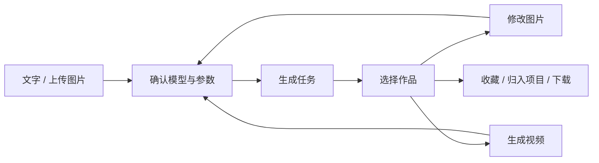

# Imagine 交互重新设计

设计日期：2026-09-05。状态：可点击原型，待体验评审。

本方案根据本次用户要求重新设计，以当前 Grok Imagine 的实际页面行为作为参考，不沿用旧任务书的阶段、布局或原有前端实现。

## 1. 参考取证

直接访问 `https://grok.com/imagine`，使用 Chromium 抓取渲染后的 HTML、DOM、控件的 role/label/state、`getBoundingClientRect()` 和 `getComputedStyle()`。实际点击比例、视频模式和手机设置，并填写草稿。截图仅用于核对抓取结果。

| 观察对象 | 实际观察 | 采用的设计原则 |
| --- | --- | --- |
| 桌面初始界面 | 创作栏在媒体内容上方；公开响应中主体宽度约 752–848 px；媒体按三列排列 | 先提供创作入口，再展示内容，不用空白画廊作为起点 |
| 手机界面 | 390 px 视口中创作表单约 366 px 宽、94–102 px 高，靠近底部；媒体双列 | 手机布局独立适配，创作栏靠近拇指 |
| 输入 | 可编辑 textbox；空输入时 Submit 禁用 | 草稿与提交状态明确区分 |
| 模式 | 图片、视频为 radio 分段控件；当前模式显示文字，其他模式收缩 | 常用模式保持直接可达，减少横向拥挤 |
| 图片比例 | 点击 Aspect Ratio 后展示 2:3、3:2、1:1、9:16、16:9，以及比例示意 | 用比例图形辅助选择，不展开永久参数栏 |
| 视频模式 | 切换后出现 480p/720p、6s/10s/15s 和音频控件 | 模式变化后替换参数，而非叠加全部参数 |
| 手机参数 | Settings 展开后集中展示质量偏好与比例 | 次要参数集中管理，主创作栏保留少量控件 |

公开页面在不同加载中出现过文案和宽度差异，因此这些尺寸是观察记录，不是像素一致性承诺。登录后的个人历史、项目和 Viewer 没有直接访问证据，下述相应设计属于本项目的设计决策。

官方参考：

- [Grok Imagine](https://grok.com/imagine)
- [Grok Imagine Video 1.5](https://x.ai/news/grok-imagine-video-1-5)：项目、媒体库搜索与连续创作。
- [Imagine Image 2.0](https://x.ai/news/grok-imagine-image-2)：编辑、参考图与图像到视频的连续工作流。

本次原始页面取证位于 `/tmp/grok-imagine-inspection-20260905/`。没有复制站点 JavaScript、CSS、品牌素材或模板图片。

## 2. 产品主线

**用户围绕一件作品连续创作，参数、服务连接和任务管理按需出现。**



一级导航只有创作、全部作品、收藏、项目。任务放在顶栏，连接和偏好放在设置。不会让用户在创作前先进入任务管理页面。

## 3. 桌面与手机布局

| 区域 | 桌面 | 手机 |
| --- | --- | --- |
| 导航 | 窄 Rail，图标有 tooltip；项目在项目页管理 | 顶部品牌与导航抽屉；不挤占创作栏空间 |
| 首屏创作 | 居中的输入区，780 px 最大宽度，媒体在其下方 | 底部固定输入区；媒体直接进入首屏 |
| 作品流 | 根据内容宽度展示三列或四列 | 双列，按图片比例预留空间 |
| 卡片操作 | 悬停与键盘聚焦时展示；收藏状态常驻 | 避免常驻大按钮；点击进入 Viewer，顶栏进入多选 |
| 参数 | 模型、比例直接打开菜单；高级项按需展示 | 单一设置入口，包含模型及服务、比例、数量、偏好 |
| Viewer | 原文件适配剩余视口，信息侧栏可收起 | 原文件居中，信息以底部浮层显示，左右滑动切换 |

视觉采用中性浅色底、低对比边界和少量绿色状态色。媒体承担主要色彩。工作区没有营销式头图或介绍卡片。控件尺寸稳定，弹层不改变底层布局。

## 4. 创作栏

1. 输入提示词，或上传/拖入/粘贴参考图。
2. 在图片、视频间切换。切换模式保留草稿；参考图超过新模型限制时阻止提交，并明确指出原因，不静默丢弃输入。
3. 选择模型时同时显示服务来源；选项的身份是 `providerId + modelId`，不能只使用模型名称。
4. 手机的模型选择集中在生成设置中，关闭面板后仍能看见当前服务、模型和参数摘要。
5. 点击提交或按 Ctrl/Cmd+Enter 后，任务立即出现；草稿继续保留，用户可以编辑下一条提示词。
6. 每个任务冻结提交时的输入与参数；后续切换模型或修改草稿不改变已提交任务。
7. 缺少连接时显示明确原因和配置入口。参数不兼容时保留用户输入，阻止错误请求。

原型支持 JPG/PNG/WebP、本地文件选择、拖放、粘贴、参考图移除及数量/大小检查。上传文件只用于本地预览，不发送到服务器。浏览器 Blob URL 在作品与输入不再引用后释放。

正式接入时，模型能力应决定可用的分辨率、时长、质量与数量。界面中的“快速/精细”必须有准确的 Provider 参数映射，不能假定不同模型支持同一种 quality 值。

## 5. 结果与继续创作

打开作品后保留原页面的筛选和滚动位置。顶部只保留返回、收藏、原文件下载、信息入口。

- 原图以原文件地址加载，缩略图仅用于作品流；下载文件名与实际 MIME 一致。
- 放大后支持拖动，双击恢复/放大，上一张/下一张既支持按钮，也支持键盘与手机横向手势。
- 信息面板展示提示词、模型、比例、类型、项目，并提供复制提示词、移动项目和删除。
- 图片的主要继续操作是“让画面动起来”，其次是修改图片、用作参考。
- 输入修改描述后回到带有原图的创作栏，保留描述供用户确认参数后提交。不会仅因上传图片就自动产生付费任务。
- 后续结果记录父作品关系。原图保留，不用新结果覆盖。
- 视频使用原生控制，触摸播放器不会触发图片切换手势。

完整的局部蒙版编辑属于正式集成范围：从 Viewer 进入，编辑上下文保留，完成后返回同一作品。原型没有放置无效的画笔或背景移除按钮。

## 6. 作品管理

- 全部作品和收藏各自具有明确的数据范围。正式实现使用服务器筛选及独立分页，不能从最近若干条中推导完整收藏。
- 搜索按提示词、标题和模型查找。没有结果时允许直接清除搜索。
- 项目可新建、重命名、删除；作品可以移动项目。删除项目只移除归档关系。
- 多选后提供收藏、移入项目和删除；撤销入口在删除后立即出现。
- 正式删除应使用可恢复的暂存阶段或服务端回收站；如果现有 API 只能不可逆删除，则提交前确认，不能承诺无法兑现的撤销。
- 原型把作品元数据、收藏和项目存到专用 localStorage 命名空间；上传文件仅保留在本次页面会话中。

## 7. 任务与反馈

| 状态 | 用户看见什么 | 下一步 |
| --- | --- | --- |
| 等待 | 作品流上方的紧凑任务条，提示词与数量 | 继续创作或取消 |
| 生成中 | 阶段文字与活动标记 | 保持页面可操作，不显示虚构百分比 |
| 完成 | 结果进入作品流，简短完成提示 | 查看、修改、收藏或归档 |
| 取消 | 任务面板保留记录，草稿不丢失 | 重新编辑 |
| 失败 | 原提示词、明确错误原因与重试入口 | 修改参数或显式重试 |
| 断线 | 保留工作区和草稿，区分客户端断线与任务失败 | 重连后恢复任务状态 |

原型已实现等待、生成中、完成、取消和任务记录。失败、断线、服务端重试和重启恢复在正式集成时接入真实状态；原型不模拟已通过这些后端验收。

收藏、删除、归档、重试的请求失败都应显示具体反馈，并恢复原状态。涉及后端的乐观更新必须在失败时可靠回滚。

## 8. 设置

设置按用户目标组织：连接、生成偏好、数据管理。

- 连接先展示名称、当前状态和模型，编辑后才展开 Endpoint、密钥和高级选项。
- 创建/编辑连接是明确的表单流程，保存与测试反馈分别显示。
- API Key 只提交到本项目服务端，不能写入原型、前端持久化或导出文件。
- 数据保留、备份等操作必须接入真实行为后才提供可操作控件。
- 主题、减少动效、默认模式和草稿策略是独立偏好，不与 Provider 配置混在一起。

原型中的设置只有演示连接开关、创作模式与清空草稿。没有真实 API Key 输入或外部测试连接操作。

## 9. 原型边界与运行

入口：`apps/web/interaction.html`。实现位于 `apps/web/src/interaction/`，没有引用原有 Shell、Composer、Gallery、Viewer 或 CSS。

```sh
pnpm --filter @imagine/web exec vite --host 0.0.0.0 --port <本任务空闲端口> --strictPort
# 打开 /interaction.html

pnpm --filter @imagine/web exec vite build --config vite.interaction.config.ts

INTERACTION_BASE_URL=http://127.0.0.1:<本任务空闲端口> node apps/web/scripts/check-interaction.mjs
```

构建输出到进程专属的临时目录，也可通过 `INTERACTION_BUILD_DIR` 指定输出位置。正式应用入口保持现状，便于独立评审新方案。

原型的生成使用固定照片及预制动画片段展示流程，不进行模型推理。数量、模式、比例、模型和创作上下文被记录；画面不根据提示词真实变化。视频素材是海面照片的六秒镜头推进，参数中的目标时长不改变这段演示文件。

这是一套可操作的交互设计，不是已经完成真实后端集成的新版产品。

## 10. 素材来源

预览照片来自 Unsplash 图片服务，仅用于本原型的内容展示。未使用 Grok 的商标、Logo 或模板素材。

| 本地文件 | 来源图片 |
| --- | --- |
| coast.webp | https://images.unsplash.com/photo-1518837695005-2083093ee35b |
| mountain.webp | https://images.unsplash.com/photo-1506905925346-21bda4d32df4 |
| lake.webp | https://images.unsplash.com/photo-1493246507139-91e8fad9978e |
| portrait.webp | https://images.unsplash.com/photo-1524504388940-b1c1722653e1 |
| interior.webp | https://images.unsplash.com/photo-1600210492486-724fe5c67fb0 |
| botanical.webp | https://images.unsplash.com/photo-1497250681960-ef046c08a56e |
| watch.webp | https://images.unsplash.com/photo-1523275335684-37898b6baf30 |
| architecture.webp | https://images.unsplash.com/photo-1486406146926-c627a92ad1ab |
| coast-motion.mp4 | 使用上述 coast.webp 本地制作的六秒动画 |

字体优先使用系统可用的 DM Sans、Noto Sans SC，缺少时使用浏览器字体回退；不再请求外部字体，以兼容正式服务的 CSP。图标使用仓库已有的 Lucide；弹层与 tooltip 使用仓库已有的 Radix。没有增加依赖或引入其他项目的页面代码。

Docker 测试构建可以设置 `--build-arg INCLUDE_INTERACTION_PREVIEW=true`，在同一 Node 服务中额外提供 `/interaction.html`。默认构建不包含原型入口。PWA 的导航回退排除这个独立页面；普通 HTTP 测试地址上的本地标识使用 `getRandomValues` 回退。

## 11. 本轮验证

- 全仓库 lint、Web TypeScript 检查、原型独立构建、现有应用生产构建通过。
- 1440×960、390×844 完成生成、取消、模型参数、原文件下载地址、收藏、继续创作、新建项目、移动项目、搜索、删除/撤销、刷新持久化及无连接状态检查。
- 两个视口的首屏 axe WCAG 2 A/AA 检查通过；不据此声称全部页面和设备的无障碍验收已完成。
- 1920×1080、430×932、360×800 额外检查创作栏边界与页面横向溢出，并保存截图。
- 视频在浏览器中实际播放，已确认媒体尺寸和播放时间推进。
- 本轮未接入真实外部 Provider，不涉及生产数据或既有宿主服务。
