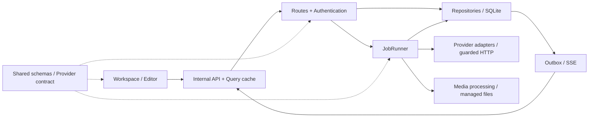

# 全项目结构与代码审查（2026-09-10）

## 范围与结论

审查基线为 `4311294`（v0.1.7）及当前工作树，范围覆盖整个项目的主干模块，而非仅未提交改动。检查了前端入口、工作区与编辑器、共享契约、账号认证与设置、系列查询、任务状态机、Provider 传输、媒体访问、离线会话及 CI/浏览器测试布局。

顶层架构符合轻量自托管应用的定位：一个 Node.js 应用、SQLite、进程内任务调度和单个业务容器。无需为了结构整理增加微服务、Redis 或其他运行服务。原审查建议优先修复下面四个已复现问题，再逐步收拢模块职责；批准范围内的实施结果记录如下。

这是基于源码、现有测试和隔离复现的审查，不等于逐行形式化验证、真实 Provider 验收或生产容量认证。用户已确定的“生成提交和上游轮询不设应用级并发上限”作为既定行为保留。

## 实施结果（2026-09-10）

R1、R2、R4、R3 已按批准范围修复，下面的问题描述保留为修复前证据。设置键上限提高至128且保留旧格式；认证入口共享限流并异步计算密码；设置PATCH与单条outbox事件原子提交，按接收账号投影可见键名；系列详情与分组共享一次构图及根节点记忆。未新增数据库迁移或运行服务，未改变生成/轮询无应用并发上限的行为。

同机、相同数据构造、一次预热后5次查询的中位数：

| 编辑代数 | 修复前 | 修复后 |
| --- | ---: | ---: |
| 200 | 129.09ms | 3.66ms |
| 400 | 665.66ms | 6.82ms |
| 800 | 3981.71ms | 10.74ms |

实施验收：完整质量检查135个测试文件、1230项测试及发布脚本检查通过；八视口72项浏览器回归通过；独立容器验证长设置键、混合设置、密码更新、认证限流、图片/视频/编辑任务和重启持久化通过。未提交推送、未部署，临时运行资源已清理。

800代深链查询约提升371倍。此为合成场景基准，不是生产容量承诺。结构整理限定在设置作用域、认证、设置事件和系列关系模块；其他大范围拆分建议保留为后续事项。

## 当前结构

```text
apps/
  web/src/
    main.tsx, app.tsx         应用入口、认证外壳、QueryClient、路由
    api/                     内部 API 客户端、DTO 校验、SSE 失效通知
    features/workspace/      实际产品 UI、页面编排、项目、系列与编辑器
    features/image-editor/   蒙版编辑状态及输入交互
    features/media-input/    上传、预处理、素材输入
    features/gallery/        画廊类型、DTO 映射、手势等复用逻辑
    features/settings/       设置查询、适配器编辑器及相关状态
    pwa-*.ts                 离线会话、快照、媒体缓存与应用更新
  server/src/
    server.ts                依赖装配、认证钩子、路由和生命周期
    routes/                  API 入口与请求授权
    database/                SQLite/Drizzle、仓储、事务和事件记录
    jobs/                    调度状态机、端口、数据库及旧接口适配
    providers/               各协议的请求映射与响应归一化
    adapters/, services/     自定义适配器安装、版本、可信 worker 执行
    security/                账号、密钥、网络策略和受保护下载
    media/, storage/         媒体加工、存储、路径和文件安全
    events/                  事件总线与 outbox 发布
    maintenance/             备份、归档、恢复与一致性维护
  server/migrations/         已发布迁移及校验清单
packages/
  shared/                    跨端 Zod 契约、模型能力与参数策略
  provider-contract/         与具体厂商无关的 Provider 接口
  testkit/                   测试构造器
fixtures/, e2e/              协议测试数据、浏览器流程与截图基线
.github/                    质量门禁、镜像烟测和发布流程
docs/                       当前规范、历史记录和本次审查
```



## 已确认问题

### R1 · P1：项目内编辑器无法保存模型及参数记忆

**触发：** 在具有 UUID 的项目里打开素材编辑器，切换模型或修改需要保存的生成参数。

[编辑器](../../apps/web/src/features/workspace/media-editing-workspace.tsx#L66)使用 `edit.<projectId>.<assetId>` 作为作用域，[generation-memory](../../apps/web/src/features/workspace/generation-memory.ts#L3)再加上 `generation.` 前缀。当项目 ID 和素材 ID 都为 UUID 时，设置键长为 **89**；[SettingsPatchSchema](../../packages/shared/src/internal-api.ts#L266)最多允许 **64** 个字符。

**复现：** 使用真实服务器内部注入请求和临时数据库，默认工作区同类键长 60，PATCH 返回 200；UUID 项目键长 89，PATCH 返回 400。该问题同时影响编辑器模型选择及通过 Composer 保存的参数，默认工作区测试无法覆盖它。

**建议：** 为编辑设置建立显式存储契约，使用有界的短键或分层 JSON；保留账号、项目、素材、媒体类型和模型的隔离，并兼容旧键读取。增加“UUID 项目 + UUID 素材”完整保存/重载回归，而不只测试默认工作区。

### R2 · P1：Basic 认证绕过登录失败限流，并同步占用主线程

[登录路由](../../apps/server/src/routes/accounts.ts#L11)对同一来源的连续登录失败实施限流，但[Basic 认证路径](../../apps/server/src/security/account-auth.ts#L57)直接调用 `login()`，没有经过同一策略。密码校验使用 [scryptSync](../../apps/server/src/security/account-auth.ts#L12)，运行在唯一的 Node.js 应用线程上。

**复现：** 对临时实例从同一来源连续发送 12 次错误 Basic 认证请求，全部返回 401，总耗时约 413ms；通过网页登录端点发送同样数量的错误请求，第 11、12 次返回 429。没有向外部服务发送请求。

**影响：** Basic 入口可以绕过现有的密码尝试防护，持续失败请求会反复执行同步 KDF。有效 Basic 请求在多个认证调用点还可能重复验证，增加正常使用成本。

**建议：** 将失败次数策略放入统一的认证服务，让登录和 Basic 使用同一策略；改用异步密码校验，并在单次请求内复用已校验身份。保留恒定成本的未知用户名处理、密码校验安全属性和会话撤销。这里的认证防护不改变已批准的 Provider 生成/轮询并发策略。

### R3 · P2：长编辑链的分组查询在分页前反复展开祖先关系

[AssetRepository.seriesPage](../../apps/server/src/database/assets.ts#L215)从每一个符合筛选条件的素材开始递归查找祖先，再计算分组、封面及分页。对于线性编辑链，同一祖先会被多个后代反复遍历；分页 `LIMIT` 位于这些计算之后。查询通过同步 SQLite 执行，因此耗时直接占用应用事件线程。

**隔离测量：** 一个账号、单条线性图片编辑链、每次输出作为下一次的主要输入；仅构造数据库记录，无真实图片生成。每组测量查询第一页 60 个条目。

| 编辑代数 | 普通列表 | 按系列分组列表 |
| --- | ---: | ---: |
| 200 | 0.89ms | 162.76ms |
| 400 | 0.54ms | 734.17ms |
| 800 | 0.54ms | 4014.67ms |

这是用于暴露算法增长的合成深链场景，不代表普通图库或生产主机的日常延迟。但它证实了长链下单次分页查询可以阻塞数秒。

**建议：** 把系列根/成员关系的计算从每次分页查询中移出，评估持久化根标识及索引，或一次性计算并复用祖先映射；统一 `series()` 与 `seriesPage()` 的关系定义。必须保留账号隔离、已删除临时视频帧的连接作用，以及搜索、收藏、项目和隐私筛选语义。增加深链、宽分支及独立素材混合数据的查询基准。

### R4 · P2：账号设置更新缺少 outbox 事件，已打开页面不能实时同步

[AccountSettingsRepository.upsertMany](../../apps/server/src/database/account-settings.ts#L27)直接写入 `account_settings`，普通账号设置分支没有写 `change_events`；全局设置则委托给会写事件的仓储。路由虽然调用了发布逻辑，但无新增 outbox 记录可发布。

**复现：** 修改 `gallery.initial_filter` 返回 200，`change_events` 增量为 0；修改全局 `network.allow_http_content` 时增量为 1。

**影响：** 当前页面由本地 mutation 更新，但同账号另一个已打开、未重新聚焦的页面没有即时通知。需要后续刷新、重新聚焦或其他重新加载机会才会取到新值。更换为新目录结构不能解决这个问题。

**建议：** 账号设置和对应事件在同一事务提交；事件携带必要的账号归属信息，SSE 做账号过滤；前端仅使相关设置查询失效。补充双页面同步与跨账号不可见验证，避免直接把账号设置变更变成面向全部用户的广播刷新。

## 结构优化顺序

以下是可维护性和性能优化建议，不作为已复现功能缺陷计算。文件长度只是定位复杂度的线索，不是拆分的唯一理由。

| 顺序 | 当前边界与问题 | 建议落点 | 验证重点 |
| --- | --- | --- | --- |
| 1 | `workspace.tsx` 同时编排项目、上传、生成、图库、系列导航与缓存更新 | 在 `features/workspace/` 内按 `generation`、`series`、`projects`、`editor` 提取协调逻辑；页面保留布局装配 | 项目隔离、切换素材、异步上传、最近封面、并发操作 |
| 2 | 系列关系、分组分页和封面选择集中在 `database/assets.ts`，且两套图查询各自维护 | 提取系列查询模块和统一关系定义，在仓储入口保持兼容 | R3 基准、循环/删除节点、账号与隐私隔离 |
| 3 | `internal-client.ts`（1175 行）和共享 `internal-api.ts`（1727 行）聚合多个业务域 | 按账号、设置、资产、任务、Provider、维护拆文件；原入口仅重导出 | 所有跨端导出和运行时 schema 一致，旧调用不必同时迁移 |
| 4 | `server.ts` 混合依赖装配、认证、路由注册、静态资源和关闭流程 | 分离基础服务装配、认证钩子及路由注册；保持一个应用进程 | 启动失败清理、正常停止、授权、任务恢复 |
| 5 | 多个 Provider 文件重复定义请求头、JSON/响应校验等基础逻辑 | 先抽取经过等价性验证的纯函数；厂商协议、目录差异和 fallback 条件保留在各自 adapter | 协议 fixture、凭据处理、401/429/超时、禁止不安全重提交 |
| 6 | 离线快照模块约 1790 行，生产映射仍引用 `FixtureGalleryItem` 等历史命名类型 | 逐步明确生产媒体视图类型，拆分会话边界、快照存储与缓存协调 | 登出/换账号、跨标签页、存储失败、缓存隔离 |
| 7 | `e2e/workspace.spec.ts` 2789 行，约 66 个顶层流程测试；配置只匹配这一个文件 | 先调整 `testMatch`，再按账号、项目、生成、编辑器、Provider、PWA 拆分；共享 fixture 与 helper | 新文件确实被发现；既有八视口和隔离运行契约保留 |
| 8 | 每个浏览器矩阵任务都独立安装并构建 | 测量构建成本后考虑复用同一提交的受控构建产物；不省略验收步骤 | 产物与提交一致、失败保留日志、八视口仍运行 |

另一个容易独立处理的小优化：[AccountSettingsRepository.get](../../apps/server/src/database/account-settings.ts#L12)目前通过 `list()` 查单键，会读取并解析该账号全部设置。可改为按键查询，并显式分派全局设置，降低项目和模型记忆增长后的无关读取成本。

## 实施分批建议

1. **先修正确性和认证：** R1、R2 各自独立提交，新增能先失败后通过的定向回归。
2. **再修状态传播：** R4 统一设置事务与事件，完成双页面、跨账号验证。
3. **再处理系列算法：** R3 先建立可重复的基准，再选择根标识/索引方案；如需迁移，新增迁移而不修改旧 SQL。
4. **最后按职责拆文件：** 客户端/契约、工作区协调逻辑和 E2E 分批推进；每批保持已有导出入口，避免一次性搬移整个仓库。

已经存在的网络地址校验、服务器端密钥加密、任务持久化、媒体路径保护和迁移校验应继续保留。目录整理不需要更换数据库、引入额外业务容器或重新增加生成请求并发上限。

## 原审查验证与限制（修复前）

- 当前源码的 `pnpm test`：131 个测试文件、1214 项测试通过，发布脚本检查通过。
- 使用临时数据库与真实服务器 `inject` 复现 R1、R2、R4；使用同一仓储实现进行 R3 合成数据测量。
- 检查了跨端 DTO、认证入口、SSE/outbox、Provider 传输和结果处理边界，以及前端工作区、离线会话与测试发现配置。
- 没有重跑真实付费 Provider 请求、外部依赖漏洞扫描或全量生产数据压测。本轮未新增 UI/业务实现，也未改动运行中的服务。
- 现有测试全绿不覆盖上述新发现；建议把复现固化为回归用例后再修复。
